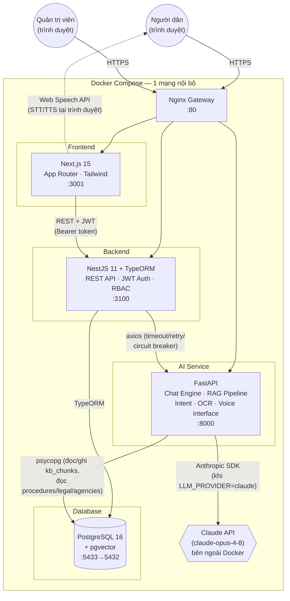

# VAIC 2026 — Architecture Diagram

## Sơ đồ thành phần (Container Diagram)

## Vai trò từng thành phần

| Thành phần | Công nghệ | Trách nhiệm |
|---|---|---|
| **Nginx** | nginx:alpine | Reverse proxy gateway — 1 cổng duy nhất (`:80`) cho demo/nộp bài, route theo path tới frontend/backend/ai-service |
| **Frontend** | Next.js 15 (App Router) + TypeScript + Tailwind | Giao diện web, quản lý phiên đăng nhập (JWT trong localStorage), gọi Backend qua REST, xử lý Voice (Web Speech API) hoàn toàn phía client |
| **Backend** | NestJS 11 + TypeORM | REST API duy nhất mà Frontend gọi trực tiếp; xác thực JWT + RBAC (secure-by-default); điều phối gọi sang AI Service; sở hữu toàn bộ nghiệp vụ CRUD (users, procedures, legal, agencies, conversations, documents, admin) |
| **AI Service** | Python FastAPI | Chat Engine (Intent Detection + RAG Pipeline), Embedding Pipeline (multilingual-e5-small, local), Vector Search (pgvector trên `kb_chunks`), OCR (Claude Vision), Voice interface (placeholder server-side, STT/TTS thật ở trình duyệt) |
| **PostgreSQL + pgvector** | PostgreSQL 16 | Cơ sở dữ liệu chính DÙNG CHUNG giữa Backend và AI Service — không có "vector database" tách riêng, `kb_chunks.embedding` là cột `float4[]` cast sang `vector` khi truy vấn (quyết định kiến trúc đã chốt Phase 3, tránh vận hành 2 hệ CSDL) |
| **Claude API** | Anthropic `claude-opus-4-8` | LLM sinh câu trả lời + phân loại ý định + đọc ảnh (vision); qua Adapter Pattern nên có thể đổi provider bằng cấu hình (`LLM_PROVIDER=mock` khi demo không có API key) |

## Nguyên tắc kiến trúc đã chốt (không đổi trong toàn bộ dự án)

1. **Frontend KHÔNG gọi thẳng AI Service** — luôn đi qua Backend (Backend là API Gateway nghiệp vụ duy nhất).
2. **1 cơ sở dữ liệu chung** — không tách vector DB riêng, giảm độ phức tạp vận hành cho MVP.
3. **Voice xử lý ở trình duyệt** (Web Speech API) — Backend/AI Service chỉ nhận transcript văn bản, không xử lý audio thô (trừ file ghi âm đính kèm qua OCR/Documents nếu có).
4. **LLM Adapter Pattern** — đổi nhà cung cấp LLM chỉ bằng biến môi trường, không sửa code nghiệp vụ.
5. **Response Format thống nhất** toàn Backend: `{ success, data | error, meta }`.

## Sơ đồ luồng nghiệp vụ chi tiết

Xem [`docs/system-integration.md`](system-integration.md) — sequence diagram Mermaid cho Chat/OCR/Voice workflow, và [`docs/ai-architecture.md`](ai-architecture.md) — chi tiết AI Engine (Prompt Manager, RAG Pipeline, Context Builder).
