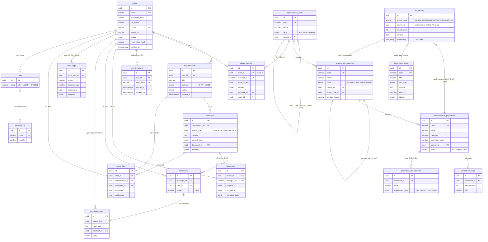

# VAIC 2026 — Database Diagram (ERD)

PostgreSQL 16 + pgvector, 19 bảng nghiệp vụ + 2 bảng nối RBAC. Mọi thay đổi schema đi qua migration TypeORM (`synchronize: false`). Xem danh sách migration đầy đủ tại `backend/src/database/migrations/`.

## Sơ đồ quan hệ

## Quy ước thiết kế

- **UUID PK** mọi bảng, `created_at`/`updated_at` chuẩn hóa qua `BaseDbEntity`.
- **Soft Delete + Audit + Optimistic Lock** (`AuditableEntity`) cho bảng dữ liệu người dùng/nghiệp vụ: `users`, `citizen_profiles`, `conversations`, `documents`. Bảng danh mục/tra cứu (procedures, legal_documents, agencies...) dùng `BaseDbEntity` (không soft delete) — "xóa" thực hiện bằng chuyển `status` (xem `known-limitations.md`).
- **`kb_chunks` là "vector database"** — không tách hệ CSDL riêng; `source_type`+`source_id` trỏ đa hình (polymorphic) tới 1 trong 3 bảng nguồn, không có FK cứng vì bản chất đa hình.
- **Mô hình hành chính 2 cấp** (`administrative_units`: chỉ `PROVINCE`/`WARD`, không có "huyện") — đúng cải cách hành chính Việt Nam hiệu lực 01/07/2025, quyết định kiến trúc đã chốt.
- **RBAC nhiều-nhiều**: `user_roles` (users↔roles), `role_permissions` (roles↔permissions) — 2 bảng nối, không có entity riêng tương ứng trong sơ đồ (join table thuần).

## Migration

Toàn bộ 6 migration (theo thứ tự áp dụng): `InitSchema` (17 bảng gốc) → `SeedRoles` → `SeedDemoData` (34 tỉnh/5 agencies/6 legal/8 procedures) → `AddDataLayerExtensions` (+`audit_logs`, `voice_logs`, cột mở rộng) → `SeedDemoDataExpansion` (mở rộng seed lên 20/20/30 + users) → `AddPasswordResetColumns`.
