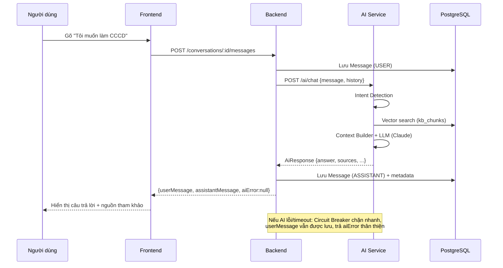
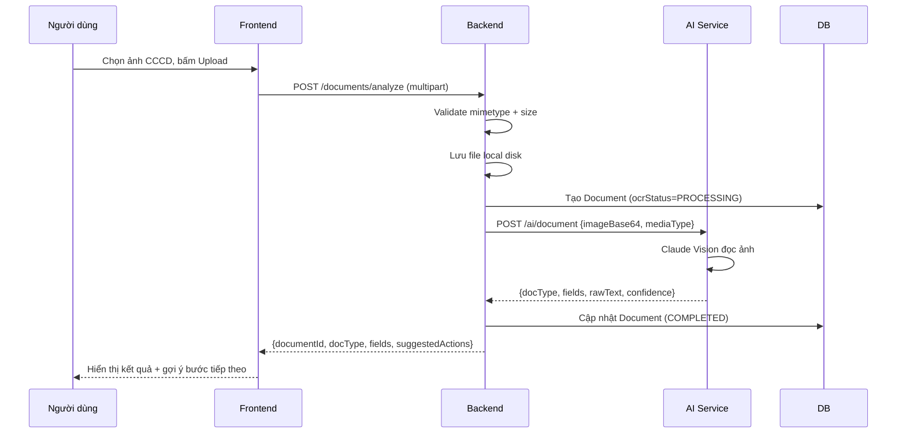
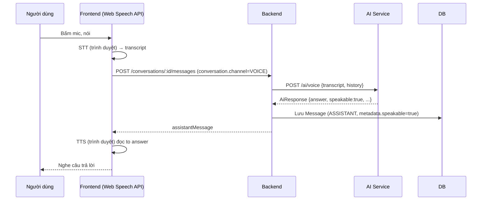

# VAIC 2026 — System Integration (PHASE 4)

## Kiến trúc tích hợp

```
Frontend (Next.js) ──HTTP+JWT──▶ Backend (NestJS)
                                       │
                          axios (timeout, retry, circuit breaker)
                                       ▼
                                 AI Service (FastAPI)
                                       │
                              embedding + pgvector search
                                       ▼
                            Claude API (claude-opus-4-8)

Backend ──TypeORM──▶ PostgreSQL (users, conversations, messages, documents,
                                 feedbacks, kb_chunks — dùng chung với AI Service)
```

## Sequence: Chat Workflow (RAG)



## Sequence: OCR Workflow



## Sequence: Voice Workflow



## API Mapping (Frontend ↔ Backend, không đổi so với thiết kế đã đóng băng)

| Frontend action | Backend endpoint |
|---|---|
| Đăng nhập/Đăng ký | `POST /auth/login`, `/auth/register` |
| Gửi tin nhắn chat/voice | `POST /conversations/:id/messages` |
| Đánh giá câu trả lời | `POST /conversations/:id/messages/:messageId/feedback` |
| Upload OCR | `POST /documents/analyze` |
| Tra cứu thủ tục/luật/cơ quan | `GET /procedures`, `/legal/documents`, `/government/agencies` (có cache) |

## Known Issues (ghi nhận minh bạch)

1. **Chưa có `ANTHROPIC_API_KEY`** — mọi câu trả lời hiện dùng Mock LLM; RAG search (embedding thật) đã verify đúng, nhưng nhánh Chat với Mock LLM trả `intent="mock"` nên không hiển thị sources thật (đã verify pipeline structure đúng).
2. Token JWT lưu `localStorage` ở Frontend — chấp nhận được cho demo, không phù hợp production (rủi ro XSS).
3. Rate Limit / Circuit Breaker / Cache là **in-memory, đơn instance** — không phù hợp triển khai nhiều container (cần Redis ở production thật).
4. File upload lưu local disk — mất khi container restart (đúng thiết kế Storage demo đã chốt).
